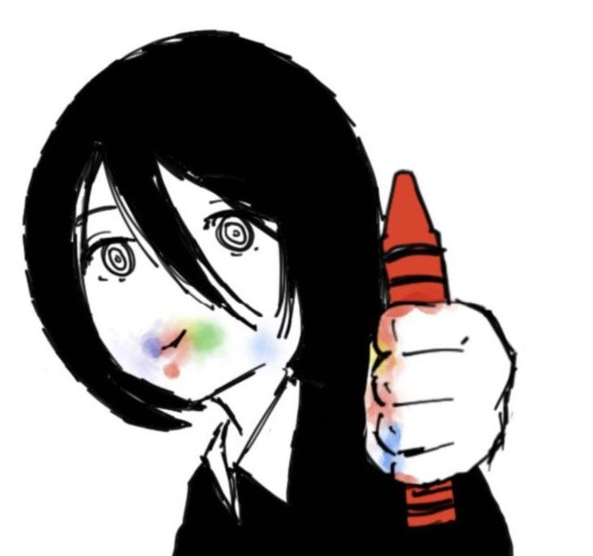

<h1 align="left">Hello I'm Frrost.</h1>

###

Back after a very long pause.

###

Mostly interested in programming, reverse engineering, malware development, anything low-level really and of course math and cryptography.

###

Passionate about cybersecurity in general.

###
> ** **

<h3 align="center">Languages i know/ i'm interested in:</h3>

###

  
  
  
  
  
  
  
  
  
  
  
  
  

###
> ** **

I am open to collaborate with anyone.

###

You can contact me on discord @yetanotherfrrost :)

###

###
